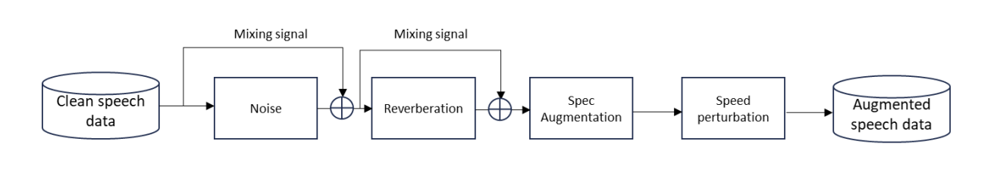
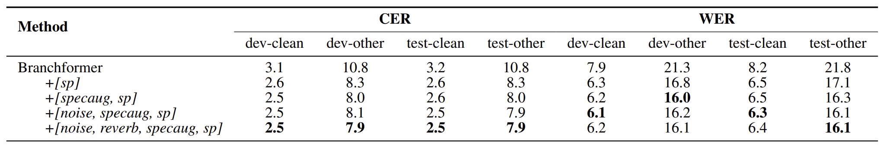

# 18751-Speech-Recognition-Project
Data Augmentation with Various Distortions Prepared by Torchaudio.

## Environment
```
cd espnet-path/egs2/librispeech_100/asr1
git clone https://github.com/chxw20/11751-Speech-Recognition-Project.git project
cd project
conda create -n aug python=3.9
conda activate aug
pip install tqdm
conda install pytorch==2.1.0 torchvision==0.16.0 torchaudio==2.1.0 pytorch-cuda=11.8 -c pytorch -c nvidia
```
## Data Augmentation Preparation

Baseline was simply the original libre 100 speech data without any augmenataion techniques.
First time, I used specaugmenation,
Second time, I used specaugmentation + noise
Lastly, I used specaugmentation + noise + noise
Espnet already has built-in speed pertubation data augmentation.
So I used the speed perturbation (x0.9, 1, 1.1) for the augmented data.


## Overview

The goal of this project is to explore the impact of different augmentation methods on the performance of ASR models. The baseline dataset is the original, unmodified Libre 100 speech data.

## Augmentation Techniques

We employed a series of augmentation strategies to enrich the dataset:

### 1. SpecAugment

The initial step involved applying SpecAugment, which manipulates the spectrogram of the audio files to create variations.

### 2. SpecAugment with Noise

Next, we introduced additive noise to the SpecAugmented data to simulate more challenging acoustic environments.

### 3. Enhanced Noise Augmentation

In a further enhancement, two layers of noise were applied in conjunction with SpecAugment to test the robustness of our ASR models against background interference.

### 4. Speed Perturbation

Using ESPnet’s built-in feature, we adjusted the speed of the audio playback at rates of 0.9x, 1x, and 1.1x, providing a form of pitch and tempo variation.




## Run
train_new = the original train data + augmented data from the original train data.
I Combined the both data for training. 
Combination of the files are then stored in train_new folder.

Then in `run.sh`:
```
#!/usr/bin/env bash
# Set bash to 'debug' mode, it will exit on :
# -e 'error', -u 'undefined variable', -o ... 'error in pipeline', -x 'print commands',
set -e
set -u
set -o pipefail

train_set="train_new"
valid_set="dev"
test_sets="test_clean test_other dev_clean dev_other"

asr_config=conf/train_asr.yaml
inference_config=conf/decode_asr.yaml

./asr.sh \
    --lang en \
    --ngpu 1 \
    --nj 16 \
    --gpu_inference true \
    --inference_nj 2 \
    --nbpe 5000 \
    --max_wav_duration 30 \
    --speed_perturb_factors "0.9 1.0 1.1" \
    --audio_format "flac.ark" \
    --feats_type raw \
    --use_lm false \
    --asr_config "${asr_config}" \
    --inference_config "${inference_config}" \
    --train_set "${train_set}" \
    --valid_set "${valid_set}" \
    --test_sets "${test_sets}" \
    --lm_train_text "data/${train_set}/text" \
    --bpe_train_text "data/${train_set}/text" "$@"
```

## Experimental Configurations

