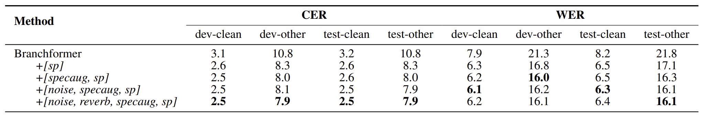

# 18751-Speech-Recognition-Project
Data Augmentation with Various Distortions Prepared by Torchaudio.
# Authors and Acknowledgements

## Code Contributors

This project was developed through the collaborative efforts of the following developers:

- **Sunghwan Baek** - Initial work and ongoing maintenance of the project.
- **Xiwen Chen** - Contributed to several key components of the code. Xiwen's contributions can be specifically found at [Xiwen Chen's Branch of the Project](https://github.com/chxw20/11751-Speech-Recognition-Project/tree/aug).

## Contact

For any inquiries, suggestions, or contributions, please feel free to contact Sunghwan Baek or check out the project repository on GitHub.


# Speech Recognition Project Setup

## Overview

This section provides detailed instructions on how to set up the environment for the Speech Recognition Project using the ESPnet framework. This setup is crucial for ensuring that the project runs smoothly and efficiently on your machine.

## Environment Setup Instructions

### Step 1: Clone the Project Repository

Navigate to your ESPnet working directory and clone the project repository:

```bash
cd <espnet-path>/egs2/librispeech_100/asr1
git clone https://github.com/Sunghwan0112/Speech-Recognition-Project.git project
cd project
```

### Step 2: Create and Activate a Conda Environment

Create a new Conda environment named aug and activate it:
```
conda create -n aug python=3.9
conda activate aug
```
### Step 3: Install Dependencies
Install the necessary Python packages using pip and conda:
```
pip install tqdm
conda install pytorch==2.1.0 torchvision==0.16.0 torchaudio==2.1.0 pytorch-cuda=11.8 -c pytorch -c nvidia
```
### Step 4: Verify Installation
To ensure that all components have been installed correctly, run the following command to check the PyTorch version:
```
python -c "import torch; print(torch.__version__)"
```
# Speech Data Augmentation for ASR

## Overview

The goal of this project is to explore the impact of different augmentation techniques on the performance of automatic speech recognition (ASR) models. Our baseline dataset is the clean, unmodified Libre 100 speech data. We aim to enrich this dataset using various augmentation methods to simulate different acoustic environments, thus testing and improving the robustness of ASR models.

## Augmentation Techniques

### 1. Noise Addition

#### First Layer of Noise
- **Description**: Clean speech data is initially mixed with a noise signal. This introduces basic environmental noise conditions into the clean speech data, mimicking more realistic and challenging listening scenarios.

### 2. Reverberation

#### Reverberation Addition
- **Description**: Following the addition of noise, the speech data undergoes reverberation processing. This simulates the echo effects present in various indoor and outdoor environments, further complicating the acoustic properties of the speech signals.

### 3. SpecAugment

#### Spectrogram Manipulation
- **Description**: After the noise and reverberation enhancements, SpecAugment is applied to the audio files. This technique alters the spectrogram by masking certain frequency bands and warping the time axis, creating a variety of speech patterns to train more adaptable ASR systems.

### 4. Speed Perturbation

#### Tempo Adjustment
- **Description**: The final step involves altering the playback speed of the audio files at rates of 0.9x, 1.0x, and 1.1x. This changes tempo of the speech, providing diverse training samples that help ASR models learn to recognize speech variations more effectively.


### Training Data
The `train_new` dataset is a combination of the original clean speech data and its augmented versions. This dataset is constructed to enhance the robustness of the ASR model by exposing it to a variety of acoustic environments.

**Procedure**:
- Combine the original training data with the augmented data.
- Store the combined dataset in the `train_new` folder for training purposes.

## Script Configuration

The `run.sh` script configures and initiates the training and testing process for the ASR model.

```
#!/usr/bin/env bash
# Set bash to 'debug' mode, it will exit on :
# -e 'error', -u 'undefined variable', -o ... 'error in pipeline', -x 'print commands',
set -e
set -u
set -o pipefail

train_set="train_new"
valid_set="dev"
test_sets="test_clean test_other dev_clean dev_other"

asr_config=conf/train_asr.yaml
inference_config=conf/decode_asr.yaml

./asr.sh \
    --lang en \
    --ngpu 1 \
    --nj 16 \
    --gpu_inference true \
    --inference_nj 2 \
    --nbpe 5000 \
    --max_wav_duration 30 \
    --speed_perturb_factors "0.9 1.0 1.1" \
    --audio_format "flac.ark" \
    --feats_type raw \
    --use_lm false \
    --asr_config "${asr_config}" \
    --inference_config "${inference_config}" \
    --train_set "${train_set}" \
    --valid_set "${valid_set}" \
    --test_sets "${test_sets}" \
    --lm_train_text "data/${train_set}/text" \
    --bpe_train_text "data/${train_set}/text" "$@"
```


